# IWNO9: Оптимизация образов контейнеров

## Цель работы
Целью работы является знакомство с методами оптимизации образов.

## Задание
Сравнить различные методы оптимизации образов:

- Удаление неиспользуемых зависимостей и временных файлов
- Уменьшение количества слоев
- Минимальный базовый образ
- Перепаковка образа
- Использование всех методов

## Подготовка
Для выполнения данной работы необходимо иметь установленный на компьютере Docker.

## Выполнение

Оптимизация Docker-образа нужна, чтобы:

1. быстрее запускался и скачивался
2. занимал меньше места
3. быстрее собирался
4. был безопаснее (меньше лишнего софта)

Создайте репозиторий containers09 и скопируйте его себе на компьютер. В папке containers09 создайте папку site и поместите в нее файлы сайта (html, css, js).

Для оптимизации используется образ определенный следующим `Dockerfile.raw`:
```Dockerfile
# create from ubuntu image
FROM ubuntu:latest

# update system
RUN apt-get update && apt-get upgrade -y

# install nginx
RUN apt-get install -y nginx

# copy site
COPY site /var/www/html

# expose port 80
EXPOSE 80

# run nginx
CMD ["nginx", "-g", "daemon off;"]
```

`nginx -g "daemon off;`

`-g` = передать глобальную директиву
`daemon off;` применяется ко всему серверу **NGINX**, а не к какому-то одному сайту или блоку

--- 

`Dockerfile.raw` - это не стандарт Docker-а, а просто файл с таким именем, который используют разработчики для своих целей. 

Создаю его в папке `containers09` и собираю образ с именем `mynginx:raw`:

```js
docker image build -t mynginx:raw -f Dockerfile.raw .
```

`-f Dockerfile.raw` указываем что для сборки используем этот файл.

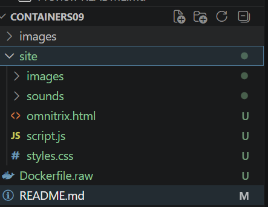

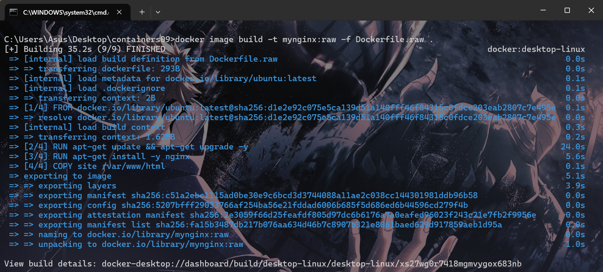

# Удаление неиспользуемых зависимостей и временных файлов

Удаляю временные файлы и неиспользуемые зависимости в `Dockerfile.clean`:

```docker
# create from ubuntu image
FROM ubuntu:latest

# update system
RUN apt-get update && apt-get upgrade -y

# install nginx
RUN apt-get install -y nginx

# remove apt cache
RUN apt-get clean && rm -rf /var/lib/apt/lists/* /tmp/* /var/tmp/*

# copy site
COPY site /var/www/html

# expose port 80
EXPOSE 80

# run nginx
CMD ["nginx", "-g", "daemon off;"]
```

Собираю новый образ с именем `mynginx:clean `и проверяю его размер:
```js
docker image build -t mynginx:clean -f Dockerfile.clean .
docker image list
```

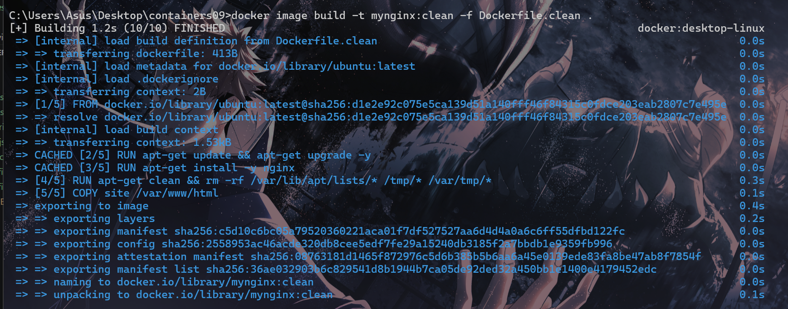

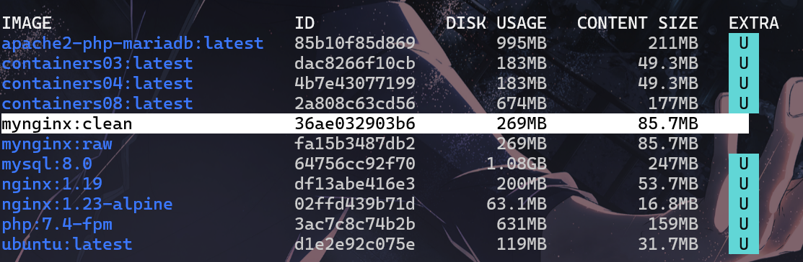


Content Size --	Размер самого образа

Disk Usage --	Реально занятое место на диске

Content Size показывает сколько весят все файлы внутри образа, считается без учёта переиспользования слоёв, одинаковый для всех копий этого образа

Disk Usagе учитывает, что слои могут делиться между образами(1 слой в нескольких образах)

- один и тот же слой хранится один раз `(Docker не дублирует одинаковые данные)`
- зависит от других образов на системе


`Сырой` и `очищенный` Образы весят `269МБ / 85.7МБ` разницы нет или почти нет.

Это объясняется следующими причинами:

- Одинаковые слои

- Кэширование Docker (clean образ собрался моментально)

- Очистка не повлияла на размер


# Уменьшение количества слоев
Уменьшаю количество слоев в `Dockerfile.few`:

```docker
# create from ubuntu image
FROM ubuntu:latest

# update system
RUN apt-get update && apt-get upgrade -y && \
    apt-get install -y nginx && \
    apt-get clean && rm -rf /var/lib/apt/lists/* /tmp/* /var/tmp/*

# copy site
COPY site /var/www/html

# expose port 80
EXPOSE 80

# run nginx
CMD ["nginx", "-g", "daemon off;"]
```

меньше слоёв здесь получается за счёт объединения нескольких команд в один `RUN`

Всё это - один слой, потому что это одна инструкция `RUN`

каждая инструкция `(RUN, COPY, ADD и т.д.)` = новый слой

3 RUN - 3 слоя  
1 RUN - 1 слой

в докерфайле также и очищаю кэш предыдущим образом.

Собираю образ с именем `mynginx:few` и проверяю его размер:

```js
docker image build -t mynginx:few -f Dockerfile.few .
docker image list
```

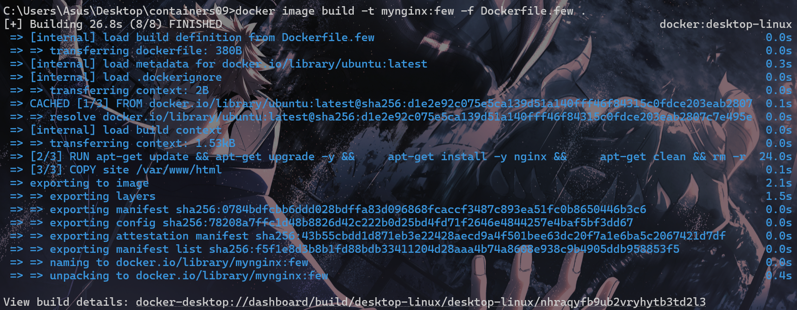
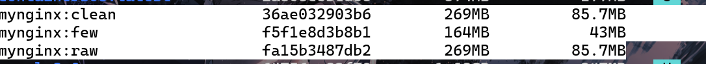

Итоговый вес значительно снизился, контент ≈ в 2 раза , использование диска ≈ 1.65 раза

# Минимальный базовый образ
Заменяю базовый образ на `alpine` и пересобираю образ:
```docker
# create from alpine image
FROM alpine:latest

# update system
RUN apk update && apk upgrade

# install nginx
RUN apk add nginx

# copy site
COPY site /var/www/html

# expose port 80
EXPOSE 80

# run nginx
CMD ["nginx", "-g", "daemon off;"]
```

Собираю образ с именем `mynginx:alpine` и проверяю его размер:
```bash
docker image build -t mynginx:alpine -f Dockerfile.alpine .
docker image list
```

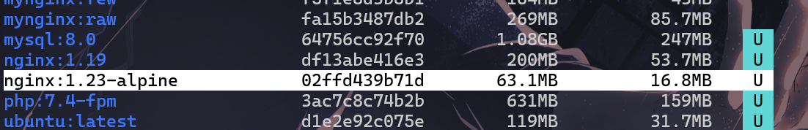

размер ЕЩЕ сильнее снизился : в 4.3 раза/ 5.1 раза по сравнению с изначальным сырым образом.

Этот образ содержит только то, что необходимо для работы конктретно этого контейнера.

`nginx:alpine` маленький потому что:

- сверхлёгкая база (Alpine)
- минимальные зависимости
- облегчённые библиотеки
- отсутствие всего лишнего

`Alpine` — это очень урезанный Linux
В нём нет лишних утилит, минимум библиотек и часто используется `BusyBox` (одна программа вместо десятков)

# Перепаковка образа

`Перепаковка (repackaging) Docker-образа` — это процесс изменения существующего образа контейнера для создания *нового*, *кастомизированного* образа. Это делается путем добавления новых слоев, изменения настроек или обновления зависимостей внутри, сохраняя при этом базовую функциональность оригинала. 

Перепаковываю образ `mynginx:raw` в `mynginx:repack`:

```js
docker container create --name mynginx mynginx:raw
docker container export mynginx | docker image import - mynginx:repack
docker container rm mynginx
docker image list
```

`docker container create --name mynginx mynginx:raw`

- создаю контейнер mynginx из образа `mynginx:raw`

`docker container export mynginx | docker image import - mynginx:repack`

делает сразу две вещи:

1. export -> выгружает файловую систему контейнера (как архив)
2. import -> создаёт новый образ **mynginx:repack**


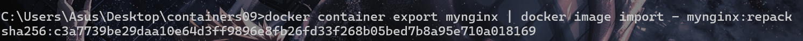

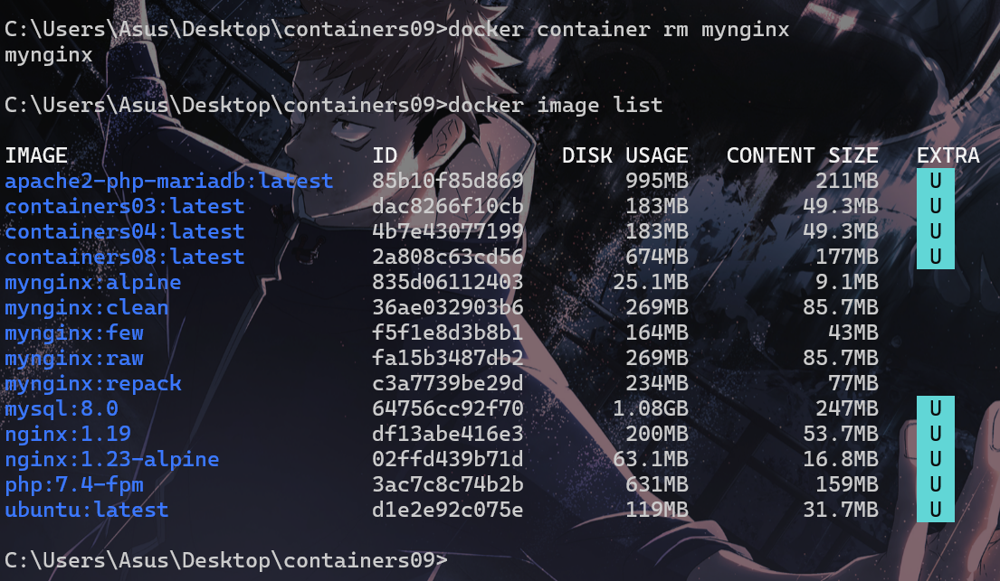

образ **“перепакован”**, все слои схлопнуты в один


- `docker container rm mynginx`

удаляет временный контейнер (он больше не нужен)

1. взял образ 
2. создал контейнер 
3. вытащил из него “чистое содержимое” 
4. собрал новый упрощённый образ 
6.  удалил контейнер

символ `-` означает:
- читать данные из стандартного ввода `(stdin)`

перепаковка через export/import: убирает слои ✔️ ,но не уменьшает мусор

если сравнить с уменьшением количества слоев : объединение в один `RUN` предотвращает появление мусора,
а перепаковка `(export/import)` просто копирует уже созданный мусор как есть.

Этот метод снизил самый первый образ на 35МБ/8.7МБ

Итого: 234/77 МБ


# Использование всех методов
Создаю образ `mynginx:min` с использованием всех методов:
```docker
# create from alpine image
FROM alpine:latest

# update system, install nginx and clean
RUN apk update && apk upgrade && \
    apk add nginx && \
    rm -rf /var/cache/apk/*

# copy site
COPY site /var/www/html

# expose port 80
EXPOSE 80

# run nginx
CMD ["nginx", "-g", "daemon off;"]
```
Собираю образ с именем `mynginx:minx` и проверяю его размер. Перепаковываю образ `mynginx:minx` в `mynginx:min`:
```bash
docker image build -t mynginx:minx -f Dockerfile.min .
docker container create --name mynginx mynginx:minx
docker container export mynginx | docker image import - myngin:min
docker container rm mynginx
docker image list
```

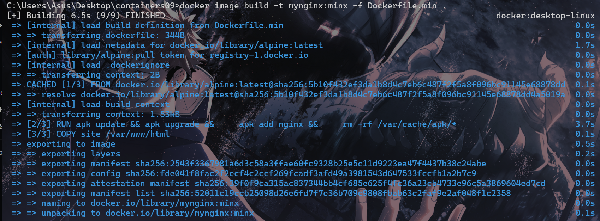

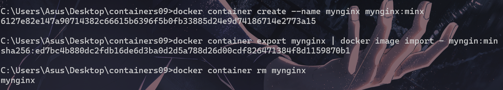

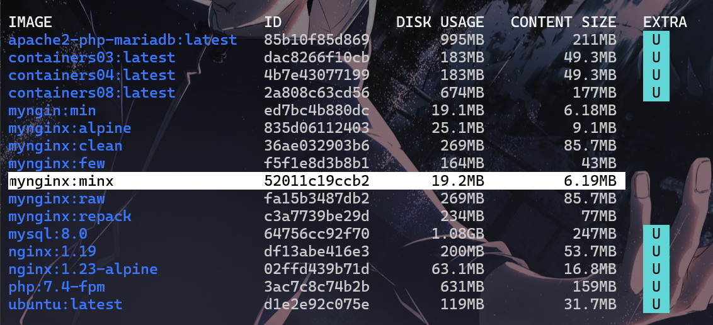


| Метод              | Что убирает        |
| ------------------ | ------------------ |
| Alpine             | тяжёлую базу       |
| один RUN           | мусор в слоях      |
| очистка            | временные файлы    |
| минимальные пакеты | лишние зависимости |
| перепаковка        | историю слоёв      |


Итого: Disk Usage и content size сократились в 14 раз.


# Запуск и тестирование
Проверьте размеры образов.
```
docker image list
```
Приведите таблицу с размерами образов.

# Ответьте на вопросы:

1. Какой метод оптимизации образов вы считаете наиболее эффективным?

Конечно, самым эффективным методом оптимизации является совмвестное использование всех способов сразу,

но наибольший вклад конкретно в моей лабораторной внесло использование минимального образа alpine, 

но в больших проектах конечно тоже важно не переусердствовать со слоями и их количеством и использовать минимальное количество **dockerfile** команд.

2. Почему очистка кэша пакетов в отдельном слое не уменьшает размер образа?

потому что в Docker слои не изменяются

- кэш сохранился в первом слое
- удаление — это новый слой(не может изменить предыдущие слои)

мусор всё равно остаётся внутри образа

3. Что такое перепаковка образа?
перепаковка образа?

👉 это:

создание нового образа из текущего состояния контейнера (export → import), когда все слои объединяются в один, история слоёв исчезает, но мусор не удаляется автоматически